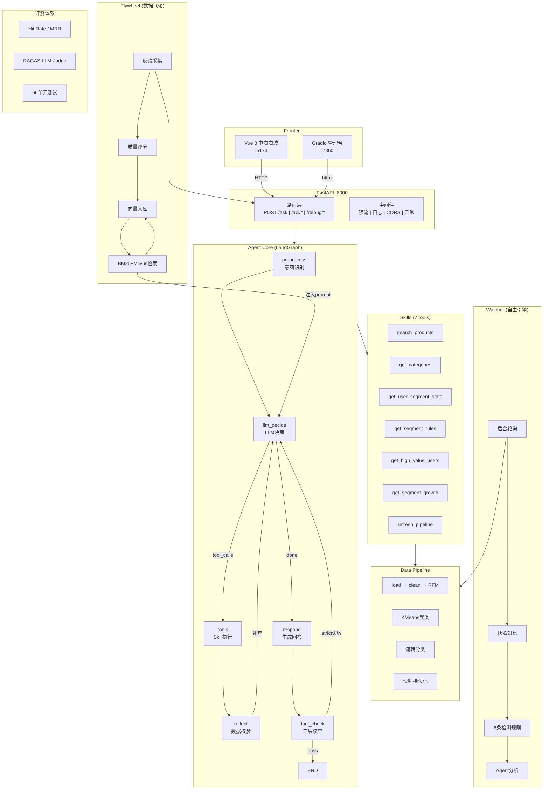

# 🛒 电商用户智能画像与AI分析平台

> AI-Native E-commerce User Profiling & Autonomous Analytics Platform

基于 **LangGraph 多智能体 + RAG + 事件驱动** 的电商用户画像平台。Agent 自主调用工具获取分群数据，三层事实核查保障数据准确性，后台引擎自动检测业务异常并触发分析。



---

## 快速启动

```bash
# 一键启动（Windows）
start.bat

# 或手动启动
uv sync                                     # 1. 安装依赖
ollama pull qwen2.5:7b nomic-embed-text     # 2. 拉取模型（需先装 Ollama）
python run_api.py                           # 3. FastAPI → :8000
python app.py                               # 4. Gradio → :7860
cd frontend && npm install && npm run dev   # 5. Vue → :5173
```

---

## 技术栈

| 层 | 技术 |
|----|------|
| Agent 框架 | LangGraph 1.2 + LangChain 1.3 |
| LLM | qwen2.5:7b (Ollama, function-calling) |
| Embedding | nomic-embed-text (768-dim) |
| 稀疏检索 | BM25 + jieba 分词 |
| API | FastAPI + Pydantic v2 |
| 管理端 | Gradio 6 |
| 电商前端 | Vue 3 + Vite + TypeScript + Pinia |
| 向量检索 | Milvus Lite / 内存余弦相似度 |
| 数据处理 | Pandas + NumPy + scikit-learn |
| 日志 | python-json-logger + RotatingFileHandler |
| 部署 | Docker Compose + GitHub Actions |

---

## 核心能力

### 1. Agentic RAG — 工具自动调用 + 物理隔离

7 个可插拔 Skill，按场景物理隔离：购物模式只暴露 2 个商品工具，分析模式只暴露 5 个分群工具。

### 2. 三层纯规则 FactCheck

零 LLM 调用、毫秒级完成：Layer 1 数值校验 / Layer 2 规则校验 / Layer 3 逻辑校验。双档位管控（relaxed / strict）。

### 3. BM25 + Milvus 混合检索

双路并发 → RRF 融合 → LLM Cross-Encoder 精排 → 质量过滤。每步自动降级。

### 4. Agent 可观测性

Gradio 内置 Trace 面板，每次对话的 6 节点执行链路：耗时、Token、输入/输出摘要。

### 5. 事件驱动自主分析

Watcher 引擎后台轮询 → 快照对比 → 6 条规则 → 事件降噪/冷却 → 自动触发 Agent 分析。

### 6. 数据飞轮

用户反馈 + 自动评分 → 向量入库 → 检索反哺 Agent 系统提示 → 回答质量越用越好。

---

## API 概览

| 分类 | 端点 | 说明 |
|------|------|------|
| AI | `POST /ask` | Agent 问答 |
| 电商 | `/api/products`, `/api/cart`, `/api/orders` | Vue 商城后端 |
| 调试 | `/debug/*` | CRUD + 数据重置 + 事件触发 |
| 统计 | `/stats/rfm`, `/stats/segment-ratio`, `/stats/flow` | 图表数据 |
| Trace | `GET /traces`, `GET /traces/{id}` | Agent 执行链路 |
| 任务 | `GET /tasks/` | 自主分析任务管理 |
| 健康 | `GET /health`, `GET /health/full` | 服务状态 |

完整文档：http://localhost:8000/docs

> 💡 **面试准备？** 看 [PORTFOLIO.md](PORTFOLIO.md) — 架构亮点 + 常见追问 + 面试自我介绍

---

## 项目结构

```
├── agent/          # Agent 核心（StateGraph + Tracer + FactCheck + Orchestrator）
├── api/            # FastAPI（路由 + 中间件 + 电商 + 数据存储）
├── pipeline/       # 数据流水线（加载 → 清洗 → RFM → 聚类 → 画像）
├── skills/         # 可插拔 Skill 框架（7 个工具）
├── watcher/        # 事件检测 + CDC + 任务管理
├── flywheel/       # 数据飞轮（采集 → 评分 → BM25+Milvus 检索）
├── eval/           # 自动化评测（25 QA + 10 Event + LLM-Judge）
├── llm/            # LLM 客户端（连接池 + 重试 + Token 统计）
├── config/         # Pydantic-settings 配置中心
├── log/            # JSON 结构化日志
├── tests/          # 66 单元测试
├── frontend/       # Vue 3 电商商城
├── app.py          # Gradio 管理台（5 Tab）
└── run_api.py      # FastAPI 启动入口
```
