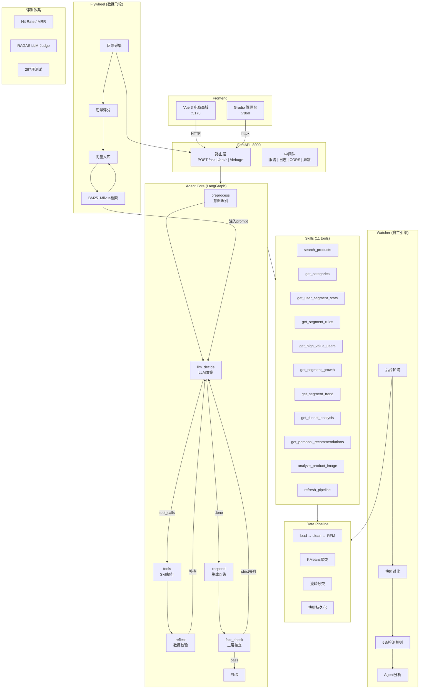

# 🛒 电商用户智能画像与AI分析平台

> AI-Native E-commerce User Profiling & Autonomous Analytics Platform

基于 **LangGraph 多智能体 + RAG + 事件驱动** 的电商用户画像平台。Agent 自主调用工具获取分群数据，三层事实核查保障数据准确性，后台引擎自动检测业务异常并触发分析。



---

## 快速启动

```bash
# 一键启动（Windows）——双击 start.bat:自动拉起 3 个服务,就绪后自动打开浏览器进入商城,启动窗口自动关闭
start.bat

# 或手动启动
uv sync                                     # 1. 安装依赖
ollama pull qwen2.5:7b nomic-embed-text     # 2. 拉取模型（本地兜底；云端主链路见下）
python run_api.py                           # 3. FastAPI → :8000
python app.py                               # 4. Gradio → :7860
cd frontend && npm install && npm run dev   # 5. Vue → :5173
```

> 🌩️ **云端主链路(可选)**:在 `.env` 配 `DASHSCOPE_API_KEY` / `DEEPSEEK_API_KEY` / `QIANFAN_API_KEY`
> 任一即可,未配 Key 的供应商自动跳过,全部失败自动降级本地 Ollama。
> 全本地调试:`LLM_PROVIDER_PRIMARY=ollama`。密钥模板见 [.env.example](.env.example)。

---

## 技术栈

| 层 | 技术 |
|----|------|
| Agent 框架 | LangGraph 1.2 + LangChain 1.3 |
| LLM | **统一适配器**:qwen3.8-max / deepseek-chat / ernie-bot-4.0(云端主链路,自动降级链)+ Ollama 本地兜底 |
| Embedding | nomic-embed-text (768-dim) |
| 稀疏检索 | BM25 + jieba 分词 |
| API | FastAPI + Pydantic v2 |
| 管理端 | Gradio 6 |
| 电商前端 | Vue 3 + Vite + TypeScript + Pinia |
| 向量检索 | Milvus Lite / 内存余弦相似度 |
| 数据处理 | Pandas + NumPy + scikit-learn |
| 日志 | python-json-logger + RotatingFileHandler |
| 部署 | Docker Compose + GitHub Actions |

---

## 核心能力

### 1. Agentic RAG — 工具自动调用 + 物理隔离

11 个可插拔 Skill（商品域 3 + 分析域 7 + 图像解析 1），按场景物理隔离：购物模式只暴露商品工具，分析模式只暴露分群工具。

### 2. 三层纯规则 FactCheck

零 LLM 调用、毫秒级完成：Layer 1 数值校验 / Layer 2 规则校验 / Layer 3 逻辑校验。双档位管控（relaxed / strict）。

### 3. BM25 + Milvus 混合检索

双路并发 → RRF 融合 → LLM Cross-Encoder 精排 → 质量过滤。每步自动降级。

### 4. Agent 可观测性

Gradio 内置 Trace 面板，每次对话的 6 节点执行链路：耗时、Token、输入/输出摘要。

### 5. 事件驱动自主分析

Watcher 引擎后台轮询 → 快照对比 → 6 条规则 → 事件降噪/冷却 → 自动触发分析:
**HIGH 事件走 Monitor→Analysis→Strategy 三阶段多 Agent 流水线**(结果三段落库,管理台可查),
普通事件单 Agent;分群历史快照画成时间趋势图,监测结果随时间可见。

### 6. 数据飞轮

用户反馈 + 自动评分 → 向量入库 → 检索反哺 Agent 系统提示 → 回答质量越用越好。

### 7. 统一大模型适配器(与康养 RAG 项目共用)

超时 / 429(按 Retry-After 退避)/ 额度不足 / 鉴权 / 上下文超长(截断重试)错误分类驱动
**多供应商自动降级链**:DashScope → DeepSeek → 千帆 → Ollama,未配 Key 自动跳过。
经 LangChain Bridge 接入 LangGraph(`llm/bridge.py`),工具绑定语义与降级链同时生效;
token 用量全链采集,Agent Trace 的节点耗时全部实测。

### 8. SSE 真流式 + 逐步工具展示

`POST /ask/stream` 实时推送每个图节点:意图识别 → 模型决策(token 级打字机)→
工具调用(名称/入参/耗时)→ 数据校验 → 事实核查 → 权威全文。
Vue 前端步骤条实时渲染执行过程。

### 9. 输入输出防护

规则式 Prompt 注入检测(加权拦截)+ 百度内容审核双向校验(fail-open 不阻断主链路)+
`/debug/*` 演示级 Api-Key 鉴权。

### 10. 会话记忆持久化 + 长对话摘要

JSON 文件版 LangGraph CheckpointSaver:多轮上下文落盘,进程重启自动恢复(实测重启后
仍记得历史对话);消息数超阈值自动压缩为要点摘要,上下文保持有界;过期会话按 TTL 清理。

### 11. 个性化推荐闭环

商品图像解析标签 → 用户画像偏好 → `get_personal_recommendations` Skill 打分推荐
(品类匹配/标签命中/价格适配消费力);推荐与搜索结果以结构化商品列表透出,
前端渲染**商品卡片 + 一键加购**,AI 导购从文字变交互。

### 12. Skill 工程化(SKILL.md 声明式 + 运行时发现 + 渐进式披露)

**Skill 是文件系统一等公民**:每个 Skill 一个目录,``skills/definitions/<name>/SKILL.md``
(YAML frontmatter + Markdown 指令),加载器启动时解析校验并注册 —— **加新 Skill 不碰代码**,
丢一个文件夹即可,定义层改动按 mtime 热加载即时生效。
**两种 Skill**:``tool`` 型(绑 Python 实现,进 LLM 工具集)/ ``instruction`` 型
(纯指令,命中时指导工具编排 —— Skill ≠ Tool 的机制证据)。
**两层发现**:确定性场景路由(购物/分析分组物理隔离,绑定名单由注册表元数据推导,
SKILL_ENABLED 开关真实生效)+ 组内描述检索打分(tags + description 重叠),
命中的 Skill 指令才注入上下文(**渐进式披露**,长指令不常驻 token)。
**可评测**:``uv run python -m eval.skill_eval`` 零 LLM 对每个 Skill 跑代表性探针,
输出状态/置信度/耗时报表。

### 13. 运营友好型分析体验

**分群业务命名**(LLM 按分群特征命名 + 确定性启发式兜底,缓存复用):对话、图表、
运营建议、环比对比全链路说人话("高价值核心用户"而非"分群2");
**对话内直接出图**:分析类 Skill 的结构化数据透出为 chart 协议,前端零依赖 SVG 渲染;
**环比对比 Skill**:`get_segment_growth` 支持指定月份("2月 vs 3月"),无快照时诚实提示可用月份;
**数据新鲜度标注**:图表注明数据时间/数据源/采样口径。

### 14. 模拟实时数据:滚动揭晓(假数据也能"活起来")

JData 整体平移是"刚体":每次重算分群结果不变 → 快照对比无差异 → Watcher 检测
在模拟数据上永远静默。**滚动揭晓**让数据面按墙钟日逐日生长:第 1 天露出原始窗口
最后 PREHEAT 天,之后每天 +1,直到全窗口进入稳态 —— 窗口增长 → 数据指纹变化 →
force_refresh → 新快照 → 事件检测真实触发(漏斗独立读 CSV 也同口径截断)。
进度落盘 `cache_data/tianchi_reveal.json`,进程重启续播;默认关闭 = 既有行为。

```env
DATA_SOURCE=tianchi
TIANCHI_REVEAL_ENABLED=true     # 默认 false(保持测试确定性)
TIANCHI_REVEAL_PREHEAT_DAYS=30  # 第 1 天露出的天数(建议 ≥7)
TIANCHI_REVEAL_STEP=1           # 每墙钟日新增天数(>1 加速演示)
```

演示不想等真的一天:`GET /debug/reveal-status` 看进度,
`POST /debug/reveal-advance {"days":1}` 手动推进后立即触发分析。

---

## API 概览

| 分类 | 端点 | 说明 |
|------|------|------|
| AI | `POST /ask` | Agent 问答 |
| 电商 | `/api/products`, `/api/cart`, `/api/orders` | Vue 商城后端 |
| 推荐 | `GET /api/recommendations`, `POST /api/product-image/analyze` | 画像推荐 / 商品图像解析(VL) |
| 调试 | `/debug/*` | CRUD + 事件触发 + 滚动揭晓状态/推进(已移除一键重置:避免清空运行时订单) |
| 统计 | `/stats/rfm`, `/stats/segment-ratio`, `/stats/flow`, `/stats/segment-trend` | 图表数据(含分群时间趋势) |
| Trace | `GET /traces`, `GET /traces/{id}` | Agent 执行链路 |
| 任务 | `GET /tasks/` | 自主分析任务管理 |
| 健康 | `GET /health`, `GET /health/full` | 服务状态 |

完整文档：http://localhost:8000/docs

---

## 项目结构

```
├── agent/          # Agent 核心（StateGraph + Tracer + FactCheck + Orchestrator）
├── api/            # FastAPI（路由 + 中间件 + 电商 + 数据存储）
├── pipeline/       # 数据流水线（加载 → 清洗 → RFM → 聚类 → 画像）
├── skills/         # 可插拔 Skill 框架（11 工具 + 1 纯指令，SKILL.md 声明式定义 + 加载器 + 选择器）
├── watcher/        # 事件检测 + CDC + 任务管理
├── flywheel/       # 数据飞轮（采集 → 评分 → BM25+Milvus 检索）
├── eval/           # 自动化评测（25 QA + 10 Event + LLM-Judge）
├── llm/            # 统一适配器（adapter.py）+ LangChain 桥接（bridge.py）+ 旧客户端
├── common/         # 公共工具（json_repair / guardrails / content_moderation）
├── config/         # Pydantic-settings 配置中心
├── log/            # JSON 结构化日志
├── tests/          # 297 项测试(283 pytest + 14 vitest:纯函数 + Agent 图 + API 集成 + 前端)
├── docs/           # 数据合规说明（DATA_COMPLIANCE.md）
├── frontend/       # Vue 3 电商商城
├── app.py          # Gradio 管理台（5 Tab）
└── run_api.py      # FastAPI 启动入口
```
